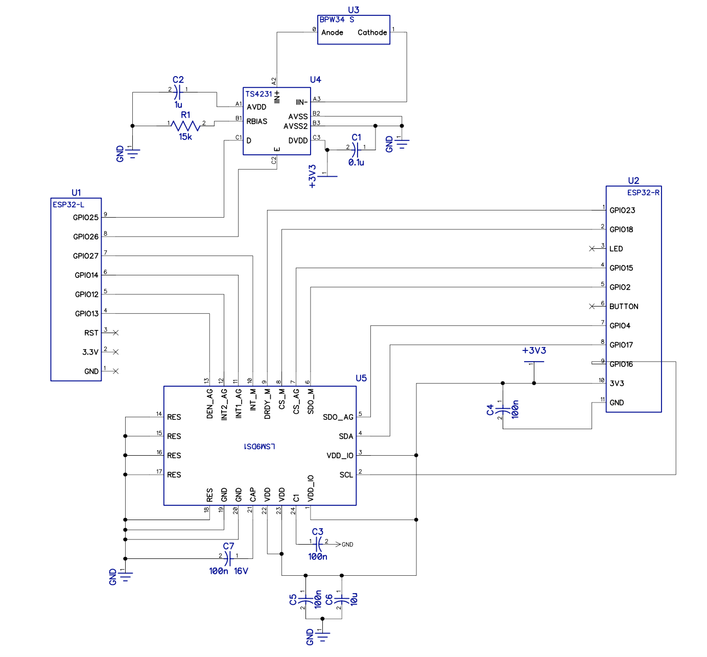
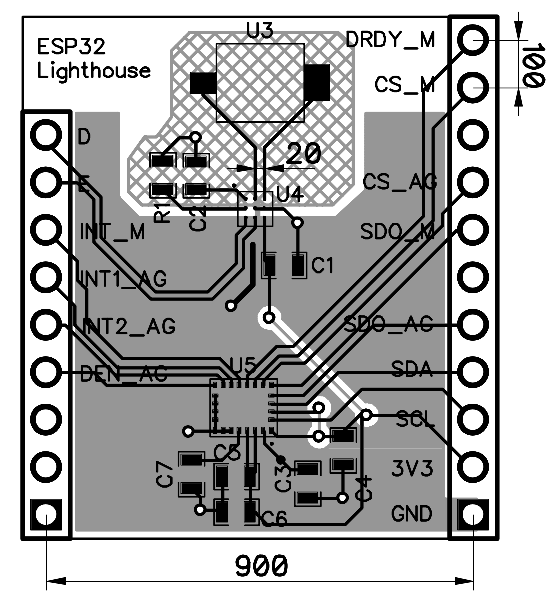

# ESP-32 Lighthouse Board

Add on board for SparkFun ESP32 Thing that determines absolute position and orientation in spacing using the Lighthouse 
and an IMU.

There will eventually be multiple boards here, but currently only the first exists:

* **[Single-chip TS4231 Board](#esp-32-lighthouse-9dof-single)**, `esp32-lighthouse-9dof-single`: directly uses the newer TS4231 chip.  This uses fine parts (a 1.6mm-square chip)), so it will be harder to solder.  It's substantially cheaper however and uses the newer chip.
* **[Castellated Module](#castellated_module)**, `esp32-lighthouse-proto-mod`: uses the TS3633 prototyping module ([datasheet](https://www.triadsemi.com/wp-content/uploads/dlm_uploads/2016/09/TS3633-CM1_Datasheet-Rev-B.pdf)), for easier soldering, but more expensive.

<a name='esp-32-lighthouse-9dof-single'>
## Single Chip TS4231 Board
</a>

Uses TS4231 WSCLP (read: tiny) chip.  Also includes 9 degree-of-freedom (9DOF) inertia measurement unit (IMU), which contains a 3-axis accelerometer, gyroscope, and magnetometer (compass). With these components it should be able to get absolute position and orientation.

### Components

The [bill of materials](https://docs.google.com/spreadsheets/d/1Z215yCS3Rhd9xmao2OCiXYKUPr7iIdqlMC3hmtdATUM/edit#gid=0) (Google sheets link) includes:

* Lighthouse light-to-digital converter chip, TS4231 ([datasheet](https://www.triadsemi.com/wp-content/uploads/dlm_uploads/2017/06/triad_semi_ts4231_datasheet_rev_a.pdf), [design guidelines](https://www.triadsemi.com/download/18126/))
* BPW34S Photodiode ([datasheet](https://media.digikey.com/pdf/Data%20Sheets/Osram%20PDFs/bpw34_spdf.pdf))
* LSM9 9-axis digital accelerometer, gyroscope, and magnetometer (optional) ([datasheet](http://www.st.com/content/ccc/resource/technical/document/datasheet/1e/3f/2a/d6/25/eb/48/46/DM00103319.pdf/files/DM00103319.pdf/jcr:content/translations/en.DM00103319.pdf))

### Pins

Avoid: 0 (Button), 5 (LED), 34-39 (Input Only, No Pulls)

Use: 13, 12, 14, 27, 26, 25, 16, 17, 14, 2, 15, 18, 23

| Device | ESP32 Peripheral | ESP32 Pin | Notes |
| --- | --- | --- | --- |
| TS4231 D | RMT timer 01 | 25 | |
| TS4231 E | RMT timer 02 | 26 | |
| LSM9 SCL/SPC | GPIO16 | 16 | | 
| LSM9 SDA/SDI/SDO (4) | GPIO17 | 17 | | 
| LSM9 SDO_AG (5) | GPIO4 | 4 | | 
| LSM9 SDO_M (6) | GPIO2 | 2 | |
| LSM9 CS_AG (7) |  GPIO15 | 15 | | 
| LSM9 CS_M (8) | GPIO18 | 18 | | 
| LSM9 DRDY_M (9) | GPIO23 | 23 | 
| LSM9 INT_M (10)  | GPIO27	 | 27 | |
| LSM9 INT1_AG (11) | GPIO14 | 14 | |
| LSM9 INT2_AG (12) | GPIO12 | 12 | |
| LSM9 DEN_AG (13) | GPIO13 | 13 | |

13 pins

### Layout

I first attempted to create the board in [KiCad](http://kicad-pcb.org/).  I thought it would be great to be able to share the design with others who could modify and tweak it.  However after a few intermittent weeks of frustration trying to learn KiCad's poor user interface (using, for instance, [this tutorial](http://babryce.com/kicad/tutorial.html)), I gave up.  The vestiges of that attempt are [here](kicad_attempt).  I got a schematic completed and the footprints designed but I just couldn't get used to KiCad's PCB editor and library management.  The fact that it takes about 10 clicks to update a footprint on a board is just ridiculous.  See [this article](http://diy-scib.org/blog/working-kicads-terrible-library-management) for additional color on some of what I was running into.

I'll come back to KiCad at some point, but I just ran out of time with a hard deadline to produce boards for a class I was giving.

I then moved to my usual PCB layout tool, [DipTrace](https://www.diptrace.com/).  I was able to knock out the components, footprints, schematic, and layout in about a day.

Note, the TS4231 is essentially a very high gain amplifier for a specific carrier frequency.  The [design guidelines](https://www.triadsemi.com/download/18126) are very insistent that it's important to minimize noise and stray capacitance.  We use a crosshatched ground (to minimize capacitance), short/matched traces (to minimize differential noise), and try to follow closely the layout on page 4.  However, I used 0603 caps instead of 0402.  I figured that one extremely fiddly part per board was enough.

Schematic ([PDF](outputs/esp32-lighthouse-9dof-single-v1-schem.pdf)):

Board Layout ([PDF](outputs/esp32-lighthouse-9dof-single-v1-board.pdf))

[Gerbers](outputs/esp32-lighthouse-9dof-single-v1)

<a name='castellated_module'>
## Castellated Module
</a>

This was an earlier attempt at using a prototyping module before I realized how much it would cost.

### Castellated Module Notes

* TS3633 Standby (12) 11 o'clock
* TS3633 VCC (1) 10 o'clock
* TS3633 Envelope  9 o'clock
* TD3633 GND 8 o'clock

Mount CM upside down?

* 0.1" pin spacing
* 0.4" pin row spacing (NOT 0.5" as indicated on datasheet -- footprint is correct)
* Standby pin in 0.1" and up 0.1"

### Using Castellated Prototyping Module vs Building ourselves
Cost analysis

| Component | Price @20|
| --- | --- |
| TS3633-CM1 ([Datasheet](https://www.triadsemi.com/download/16617/)) | $6.95 | 
| **Total** | **$6.95** |

Vs

| Component | Price @20|
| --- | --- |
| TS4231 Light to digital converter ([Datasheet](https://www.triadsemi.com/download/17260/)) | $0.95 | 
| BPW34S Photodiode ([Datasheet](http://www.mouser.com/ds/2/311/BPW%2034%20S,%20Lead%20(Pb)%20Free%20Product%20-%20RoHS%20Compliant-335799.pdf)) | $0.553 |
| Capacitor 1.0 uF 0402 | $0.036 |
| Capacitor 0.1 uF 0402 10% | $0.015 | 
| Resistor 15k 1% | $0.023
| **Total** | **$1.577** |

#### Optional 9DOF Accel/Gyro/Mag

| Component | Price @20|
| --- | --- |
| LSM9DS1 | $5.28 |

